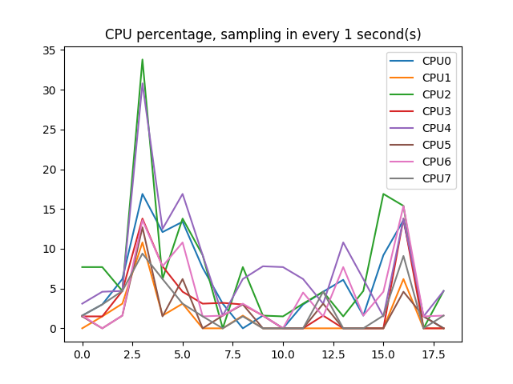
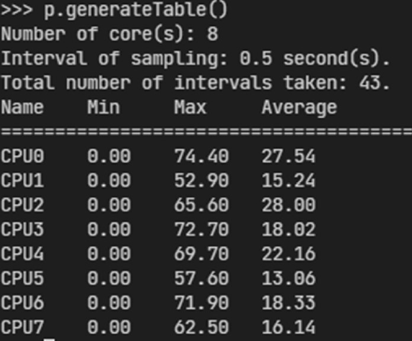

# CPU Profiler

# Sample Usage 1

```py
from cpuProfiler import CPUProfiler

p = CPUProfiler(interval=0.5)	# Create a CPUProfiler instance, sample every 0.5 s.
p.start()			# Start profiling.
...
p.stop()			# Stop profiling.
p.generateTable()	# Generate profiling result table.
p.plot()			# Plot profiling result.
p.clear()			# Clear previous profiling records.
```

# Sample Usage 2

```py
from cpuProfiler import cpuProfilerFn

@cpuProfilerFn		# Profile the yourMethod every 1 second, create a plot and table after the method returns.
def yourMethod():
	...
```

# Example result

